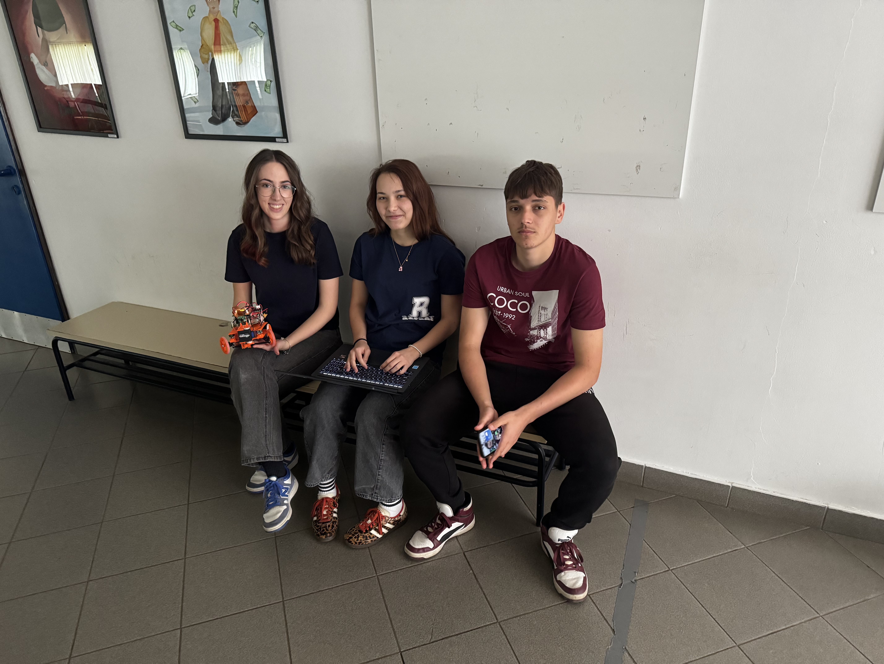
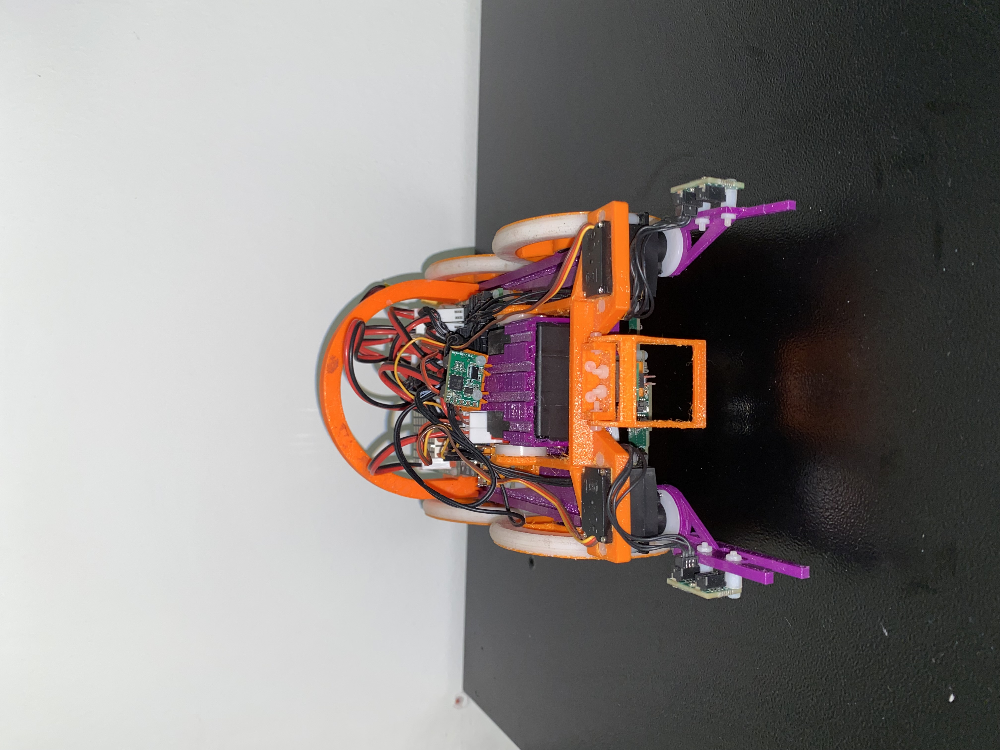
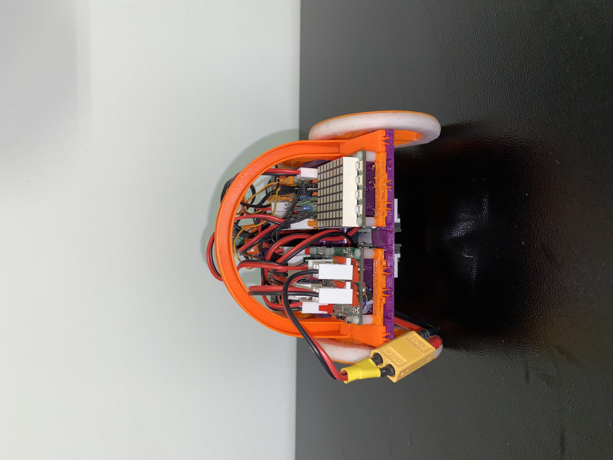
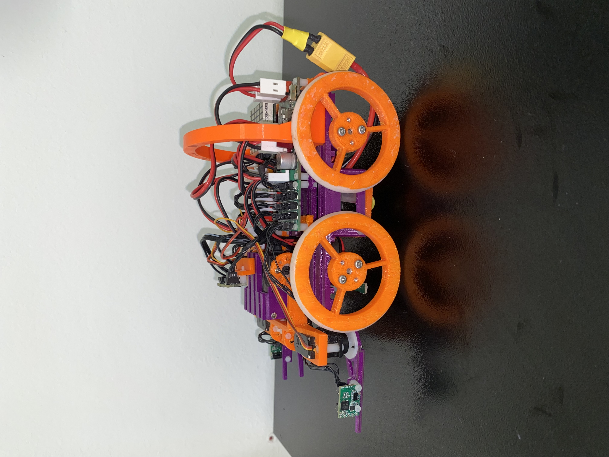
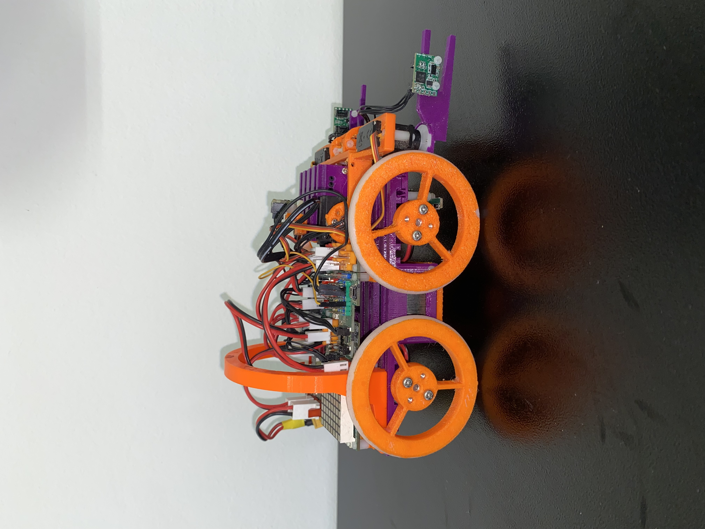
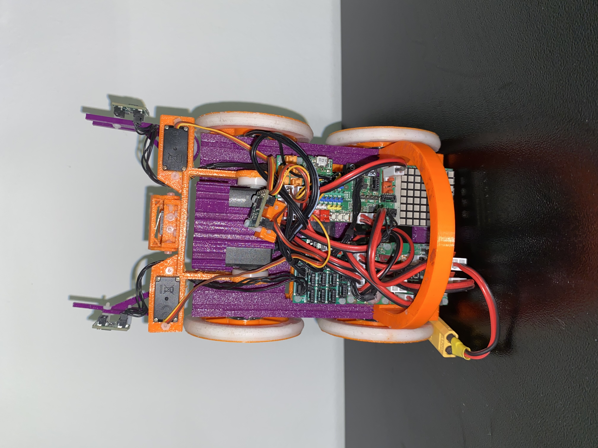
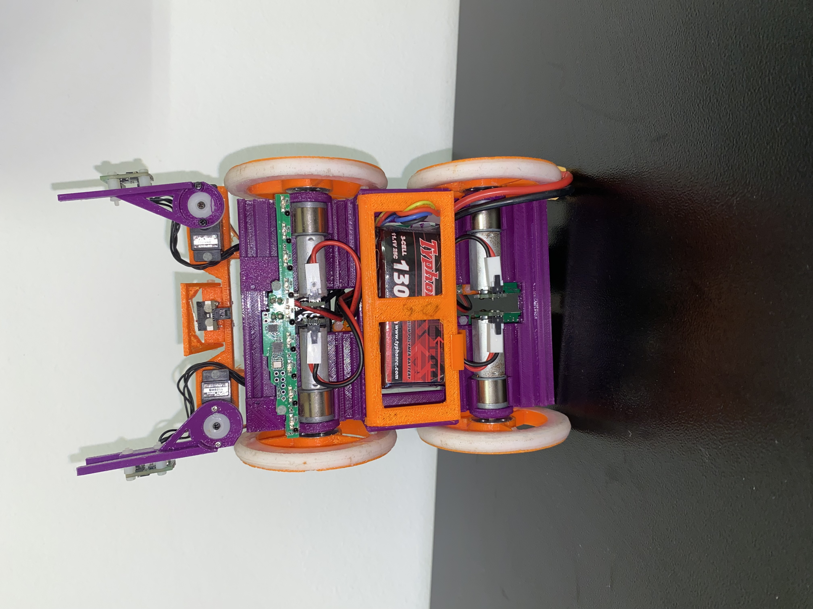

# MechaMinds-WRO 2026 Future Engineers
# WRO Future Engineers - Engineering Documentation
# Team Members
- **Nadia Kravčuk**-
- **Ivano Koren**-Ivano spearheaded the physical construction of the vehicle, optimizing the chassis layout, steering geometry, and weight distribution, while the team assisted in testing mechanical durability.
- **Barbara Lukić**

## Table of Contents

1. Project Overview
2. Team
3. Vehicle Overview
4. Development History
   4.1 Prototype V1
   4.2 Prototype V2
   4.3 Prototype V3
   4.4 Current Robot
   4.5 Crash / Failure Analysis and Redesign

5. Mobility & Mechanical Design
   5.1 Chassis
   5.2 Drive System
   5.3 Steering System
   5.4 Dimensions and Weight
   5.5 Torque / Speed Reasoning
   5.6 Mechanical Testing and Iterations

6. Power & Sensor Architecture
   6.1 Controller
   6.2 Motors
   6.3 Sensors
   6.4 Sensor Placement
   6.5 Wiring Diagram
   6.6 Power Architecture
   6.7 Sensor Calibration and Testing

7. Software Architecture
   7.1 Overview
   7.2 Program Structure
   7.3 State Machine / Flowchart
   7.4 Open Challenge Strategy
   7.5 Obstacle Challenge Strategy
   7.6 Control Algorithms
   7.7 Edge Cases and Failure Handling

8. Engineering Decisions
   8.1 Constraints
   8.2 Design Trade-offs
   8.3 Major Problems and Solutions
   8.4 Why We Chose X Instead of Y

9. Testing & Results
   9.1 Mechanical Tests
   9.2 Sensor Tests
   9.3 Open Challenge Tests
   9.4 Obstacle Challenge Tests
   9.5 Reliability Results

10. Components / Bill of Materials

11. Build & Reproduction Guide
   11.1 Parts
   11.2 Assembly
   11.3 Wiring
   11.4 Software Installation
   11.5 Uploading / Running the Code

12. Repository Structure

13. Version History

14. Engineering Journal

15. Authors / Team

## 1. Project Overview
## 4. Development history
Our robot wemt through several major design iterations during the development process.
### Version 1
|||

| Front | Rear |
|---|---|
|  |  |

| Left | Right |
|---|---|
|  |  |

| Top | Bottom |
|---|---|
|  |  |
