# MechaMinds-WRO 2026 Future Engineers
# WRO Future Engineers - Engineering Documentation
## Team Members
- **Barbara Lukić**
- **Nadia Kravčuk**
- **Ivano Koren**

[](video/video_mechaminds.mp4)


## Table of Contents

- [1. Project Overview](#1-project-overview)
- [2. Team](#2-team)
- [3. Vehicle Overview](#3-vehicle-overview)

- [4. Development History](#4-development-history)
  - [4.1 Version 1](#41-version-1)
  - [4.2 Version 2](#42-version-2)
  - [4.3 Version 3](#43-version-3)
  - [4.4 Version 4](#44-version-4)
  - [4.5 Current Robot](#45-current-robot)
 
- [5. Mobility & Mechanical Design](#5-mobility--mechanical-design)
  - [5.1 Chassis](#51-chassis)
   - [5.2 Drive System](#52-drive-system)
  - [5.3 Steering System](#53-steering-system)
  - [5.4 Dimensions and Weight](#54-dimensions-and-weight)
  
- [6. Power & Sensor Architecture](#6-power--sensor-architecture)
  - [6.1 Motors](#61-motors)
  - [6.2 Sensors](#62-sensors)
  - [6.3 Camera](#63-camera)
  - [6.4 Wiring Diagram](#64-wiring-diagram)
  - [6.5 Power](#65-power)
  - [6.6 ON/OFF Button](#66-onoff-button)
  
- [7. Software Architecture](#7-software-architecture)
  - [7.1 Overview](#71-overview)
  - [7.2 Code](#72-code)
  - [7.3 Open Challenge Strategy](#73-open-challenge-strategy)
  - [7.4 Obstacle Challenge Strategy](#74-obstacle-challenge-strategy)
    
- [8. Engineering Decisions](#8-engineering-decisions)
  - [8.1 Major Problems and Solutions](#81-major-problems-and-solutions)

- [9. Testing & Results](#9-testing--results)

- [10. Components / Bill of Materials](#10-components--bill-of-materials)

- [11. Build & Reproduction Guide](#11-build--reproduction-guide)
  - [11.1 Parts](#111-parts)
  - [11.2 Assembly](#112-assembly)

- [12. Repository Structure](#12-repository-structure)
- [13. Engineering Journal](#13-engineering-journal)


## 1. Project Overview
Our project is an autonomous vehicle that can navigate the competition field, detect and avoid obstacles, follow the track and make real time decisions without human intervention.

<p align="right">
  <a href="#table-of-contents">⬆ Back to Table of Contents</a>
</p>

## 2. Team
We are the Croatian robotics team **MechaMinds** and our names are **Barbara Lukić**, **Ivano Koren** and **Nadia Kravčuk**. We come from Tin Ujević High School in Kutina. Our mentor's name is Damir Petravić. Together we worked on the design of the robot, programming and testing our robot.

<p align="right">
  <a href="#table-of-contents">⬆ Back to Table of Contents</a>
</p>

## 3. Vehicle Overview
| Specification | Value |
|---|---|
| Length | 18 cm |
| Width | 17.5 cm |
| Height | 15.5 cm |
| Weight | 0.876 kg |
| Drive type | Rear-wheel drive |
| Steering type | Ackermann steering |     ---Servo-controlled front steering???
| Main controller | Raspberry Pi 5 Model (B Rev1.1) |
| Programming language | C++ |
| Main sensors | MRMS LIDAR 2 m (VL53L0CX), CAN Bus |
| Camera | Raspberry Pi Camera Module 3 |
| Power source | Turnigy 5S LiPo, 18.5 V, 5000 mAh |

<p align="right">
  <a href="#table-of-contents">⬆ Back to Table of Contents</a>
</p>

## 4. Development history 
Our robot went through several major design changes during the development process. 
### 4.1. Version 1 
**About the robot** 
  - Our first robot was a custom-built vehicle made using 3D-printed and hand-built parts. It had several distance sensors that helped us test the robot.

**Main problem** 
  - The robot was not reliable enough to complete three laps so we decided to change the robot for better performance.

| Front | Rear |
|---|---|
|  |  |

| Left | Right |
|---|---|
|  |  |

| Top | Bottom |
|---|---|
|  |  |

<p align="right">
  <a href="#table-of-contents">⬆ Back to Table of Contents</a>
</p>

### 4.2. Version 2
**About the robot**
- This robot was an upgraded version of the first one, it had a camera and several distance sensors.
  
**Main problem**
- All year we have been working on this robot, about two months before the competition we started having problems connecting the robot to Wi-Fi, it started crashing and we tried to find a solution before the competition but we did not succeed.

| Front | Rear |
|---|---|
|  |  |

| Left | Right |
|---|---|
|  |  |

| Top | Bottom |
|---|---|
|  |  |

<p align="right">
  <a href="#table-of-contents">⬆ Back to Table of Contents</a>
</p>

### 4.3. Version 3
**About the robot**
- This robot was built out of LEGO, it represents a model of a Ford car.

**Main problem**
- The robot had a problem turning its wheels because of the design, so it could not complete even one lap, because of this we had to completely redesign it.

| Front | Rear |
|---|---|
|  |  |

| Left | Right |
|---|---|
|  |  |

| Top | Bottom |
|---|---|
|  |  |

<p align="right">
  <a href="#table-of-contents">⬆ Back to Table of Contents</a>
</p>

### 4.4. Version 4
**About the robot**
- This was our final robot that we went to the competition with, it was also built out of lego bricks, it worked with the help of distance sensors.
  
**Main problem**
- Although we went to the competition with this robot it still had a few flaws. The LEGO sensors that we used to measure distance were not able to detect walls from sufficient distance so the robot couldn't complete even one lap.

| Front | Rear |
|---|---|
|  |  |

| Left | Right |
|---|---|
|  |  |

| Top | Bottom |
|---|---|
|  |  |

<p align="right">
  <a href="#table-of-contents">⬆ Back to Table of Contents</a>
</p>

### 4.5 Current Robot
The robot we will use for the competition in Zagreb is [4.2 Version 2](#42-version-2) the connection problem was solved. The solution can be found in [8.1 Major Problems and Solutions](#81-major-problems-and-solutions)

<p align="right">
  <a href="#table-of-contents">⬆ Back to Table of Contents</a>
</p>

## 5. Mobility & Mechanical Design
### 5.1 Chassis

#### Chassis Overview
Our current vehicle uses a four-wheel chassis, the chassis provides the mechanical base for the drive system, steering mechanism, sensors and processing hardware. The design was developed with stability, compact dimensions and reliable steering in mind.

#### Component Placement
The electronic components are arranged on several levels above the main chassis plate. The battery is positioned low inside the chassis to keep the center of gravity as low as possible, while the processing and control electronics are placed above it. The camera is placed at the front of the robot on a dedicated 3D-printed support so it could have good visibility of the field. The distance sensors are positioned near the front of the vehicle so that they can detect the surrounding walls during navigation.

(gdje se nalaze no) **TU CE ICI SLIKA SVEGA**
- Main controller: on top of the robot
- Battery: inside the chassis
- Drive motor: in the back, underneath the chassis
- Steering servo: in the front, underneath the chasis
- Sensors: in the front, inside the chassis
- Camera: the front of the robot

<p align="right">
  <a href="#table-of-contents">⬆ Back to Table of Contents</a>
</p>

### 5.2 Drive System

**TU TREBA SLIKA OD DOLJE I ZADNJI KOTACI (POGON)**

<p align="right">
  <a href="#table-of-contents">⬆ Back to Table of Contents</a>
</p>

### 5.3 Steering System

The vehicle uses a servo-controlled front steering mechanism. A steering servo placed at the front of the chassis moves a mechanical linkage that connects the two front wheels. Instead of controlling the left and right wheels with separate motors, both front wheels are mechanically linked and change direction together. This provides car-like steering while the rear wheels make the robot move forward. The steering components are mounted directly to the 3D-printed chassis, which allowed us to adjust the geometry and mounting positions during development.

<p align="center">
  
</p>

<p align="center">
  <em>Front steering mechanism and mechanical linkage.</em>
</p>

<p align="right">
  <a href="#table-of-contents">⬆ Back to Table of Contents</a>
</p>

### 5.4 Dimensions and Weight

| Measurement | Value |
|---|---|
| Length | 180 mm |
| Width | 175 mm |
| Height | 155 mm |
| Weight | 0.876 kg |
| Wheelbase | 100 mm |
| Front track width | 175 mm |
| Rear track width | 170 mm |
| Front wheel diameter | 60 mm |
| Rear wheel diameter | 65 mm |

<p align="right">
  <a href="#table-of-contents">⬆ Back to Table of Contents</a>
</p>


## 6. Power & Sensor Architecture
### 6.1 Motors

The robot is powered by a single ML-R BDC N20 micro brushed DC motor. It operates at 12V DC with a low-power profile, ensuring high efficiency for battery-powered operation. The integrated 1:100 gear ratio provides high output torque within a compact 12 mm form factor. This motor serves as the primary drive source for the robot's propulsion mechanism.

<p align="left">
  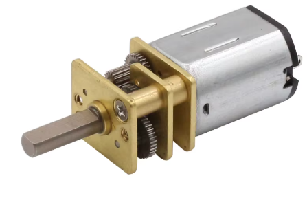
</p>

<p align="right">
  <a href="#table-of-contents">⬆ Back to Table of Contents</a>
</p>

### 6.2 Sensors

The robot uses MRMS VL53L0CX LiDAR sensors to measure the distance to nearby obstacles. The sensors have a specified range of up to 2 m and communicate with the rest of the system via CAN Bus. Each robot is equipped with three LiDAR sensors, allowing distance measurements in multiple directions. The collected data can be used for obstacle detection, navigation, and collision avoidance. Both LiDARSs are placed at the front of the robot, each on one side, between two chassis and at the angle of 45° so they wouldn't be too high nor too low to not be able to detect walls from the side and from the front.

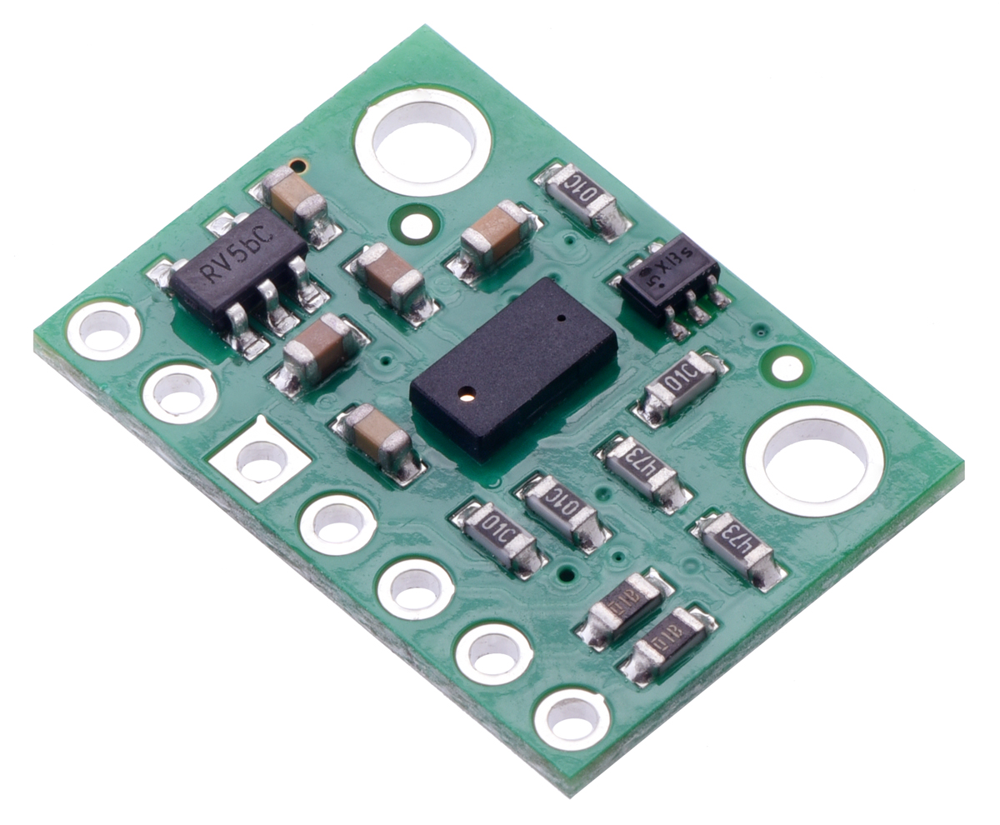 

<p align="right">
  <a href="#table-of-contents">⬆ Back to Table of Contents</a>
</p>

###  6.3 Camera

The robot uses a Raspberry Pi Camera Module 3 for visual perception of its surroundings. The camera is connected to the Raspberry Pi 5 and can be used to capture images and video for further processing. It can support tasks such as line detection, object recognition, marker detection, and navigation. The camera complements the LiDAR sensors by providing visual information that distance sensors alone cannot provide.

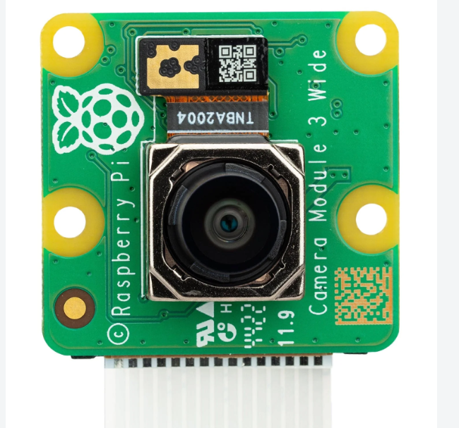 

<p align="right">
  <a href="#table-of-contents">⬆ Back to Table of Contents</a>
</p>

### 6.4 Wiring Diagram

<p align="right">
  <a href="#table-of-contents">⬆ Back to Table of Contents</a>
</p>

### 6.5 Power
#### Battery

Our robot is powered by a Turnigy 5.0 High Discharge LiPo battery. 
The battery was selected to provide sufficient voltage, capacity and 
current for the robot's motors and electronic components.

#### Specifications

| Parameter | Value |
|---|---|
| Battery type | LiPo (Lithium Polymer) |
| Configuration | 5S |
| Nominal voltage | 18.5 V |
| Capacity | 5000 mAh (5.0 Ah) |
| Discharge rating | 20–30C |
| Discharge current | 150 A |
| Manufacturer | Turnigy |
| Model | Turnigy 5.0 |
| Main connector | High-current connector |
| Balance connector | 5S balance connector |

We chose this battery because our robot requires a power source capable of 
supplying high current to the motors while maintaining a stable voltage.

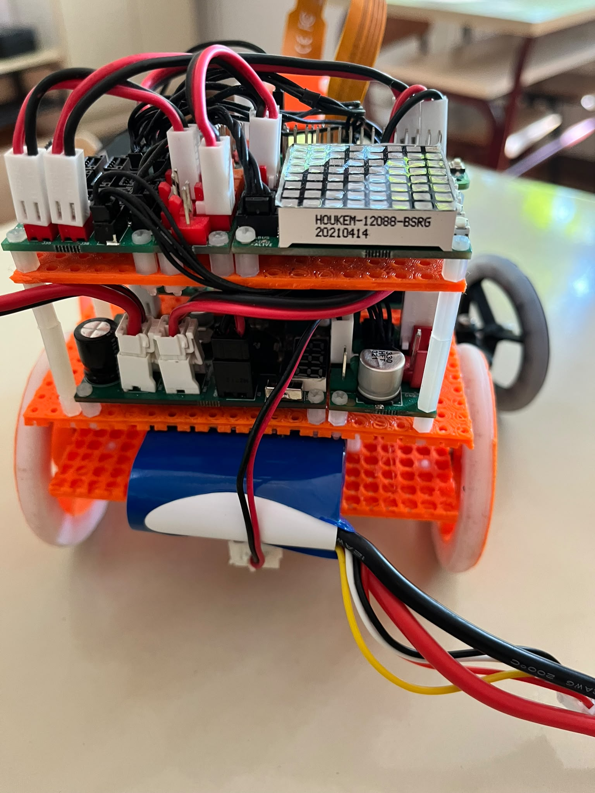 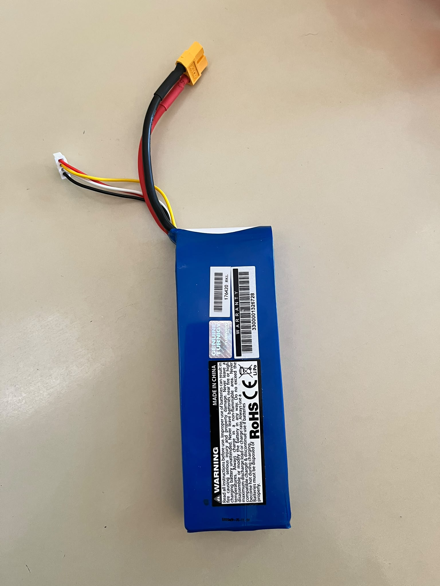 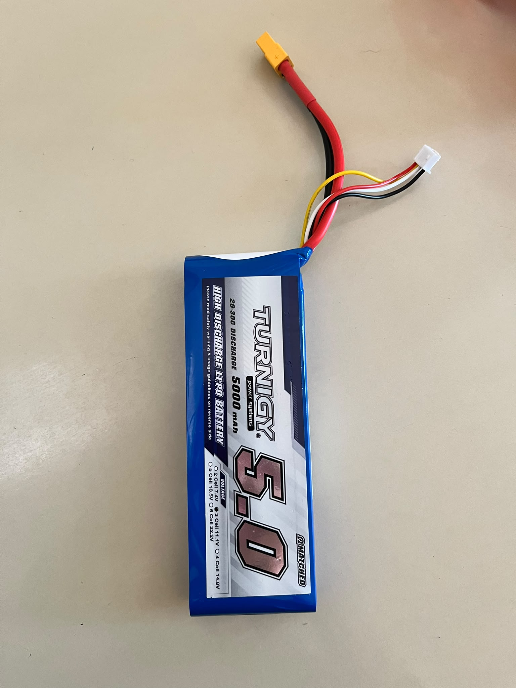
#### Charger

The robot uses a B6 LiPro 80W Balance Charger to charge the LiPo battery. It supports 1–6 cell LiPo batteries and includes a balance function to keep the voltage of the individual cells equal during charging.

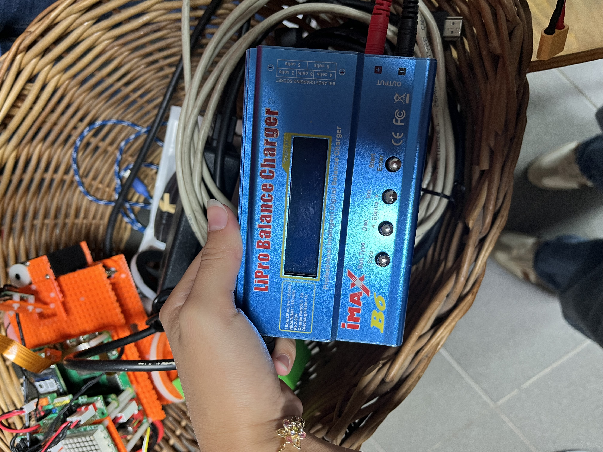

<p align="right">
  <a href="#table-of-contents">⬆ Back to Table of Contents</a>
</p>

### 6.6 ON/OFF Button
The buttons used to turn the robot on, start it, and stop it was placed on top to make it easily accessible.

<p>This section explains the code structure and button controls for operating the robot.</p>

<h4 align="center">Code for Buttons</h4>

<p align="center">
  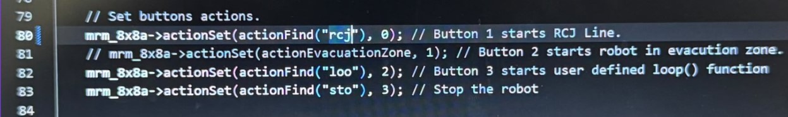
</p>

<p align="center">
  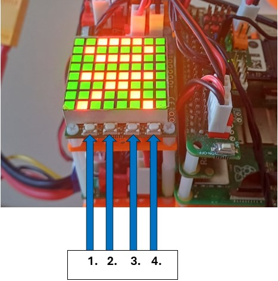
</p>

<h4>Button Functions</h4>

<p><strong>1. Button 1 (Pin 1) &ndash; Start / Stop:</strong> Launches <code>system_start()</code> or halts the robot with <code>full_stop()</code>.</p>

<p><strong>2. Button 2 (Pin 2) &ndash; Open Challenge:</strong> Selects and starts <code>open_challenge()</code>.</p>

<p><strong>3. Button 3 (Pin 3) &ndash; Obstacle Challenge:</strong> Selects and starts <code>prepreke_challenge()</code>.</p>

<p><strong>4. Button 4 (Pin 4) &ndash; Servo +2°:</strong> Manually increases the servo angle by 2 degrees.</p>

<p align="right">
  <a href="#table-of-contents">⬆ Back to Table of Contents</a>
</p>

## 7. Software Architecture
### 7.1 Overview
### 7.2 Program Structure
### 7.3 State Machine / Flowchart
### 7.4 Open Challenge Strategy
  -  For the open challenge we decedided that robot is going to use two ______ distance/giro??? sensors to avoid all the walls and to turn in a right direction.
### 7.5 Obstacle Challenge Strategy
  - For the obstacle challenge the strategy was to asamble a camera that 
### 7.6 Control Algorithms
### 7.7 Edge Cases and Failure Handling

The robot software is written in C++. The code is developed and maintained within Visual Studio Code, utilizing dedicated extensions for embedded C++ compilation and debugging. The software architecture handles direct motor control, power management, and timing routines required for accurate motor drive operations.

<p align="right">
  <a href="#table-of-contents">⬆ Back to Table of Contents</a>
</p>

### 7.2 Code
<p align="right">
  <a href="#table-of-contents">⬆ Back to Table of Contents</a>
</p>

### 7.3 Open Challenge Strategy

The Open Challenge requires the robot to complete three laps of the track autonomously without colliding with obstacles. During the run, the robot uses its LiDAR sensors and camera to detect the track boundaries and nearby objects. Based on the sensor data, the control system continuously adjusts the robot’s direction and movement. The main goal is to achieve reliable navigation, smooth cornering, and consistent obstacle avoidance throughout all three laps.

<p align="right">
  <a href="#table-of-contents">⬆ Back to Table of Contents</a>
</p>

### 7.4 Obstacle Challenge Strategy

<p>The robot uses a <b>Raspberry Pi Camera Module 3</b> connected to a <b>Raspberry Pi 5</b>, enabling image and video capture for line detection, object recognition, and color marker detection. While LiDAR sensors handle wall-following and distance measurement, the camera provides visual perception that distance sensors alone cannot supply. By combining wall-following via LiDAR with visual processing from the camera, the robot actively detects red and green obstacles. The system processes camera data in real time to steer correctly around color-coded markers while maintaining high-speed autonomous navigation. This dual-sensing setup ensures precise positioning and seamless obstacle avoidance required to complete all three laps fully autonomously.</p>

<p align="right">
  <a href="#table-of-contents">⬆ Back to Table of Contents</a>
</p>


## 8. Engineering Decisions
### 8.1 Major Problems and Solutions
#### Connection Failure 

- During development, we experienced repeated problems with the Wi-Fi connection between the robot and the development computer. The connection was unstable and we could not work with the robot properly. To improve reliability, we tested a wired Ethernet connection using an RJ45 network cable. During our tests, this connection proved to be significantly more stable and reliable than Wi-Fi, so we decided to use the wired connection during development.

 
 

#### Sensor Placement

- During testing, the distance sensors were positioned on the upper part of the robot. In this position, the sensors were too high and could not reliably detect the wall directly in front of the vehicle. After identifying this issue, we redesigned the sensor position and moved the distance sensors lower on the chassis. This improved their field of view and allowed them to detect the wall more reliably. This change showed us how sensor placement can affect the performance of the navigation system.

  

**Test result:**
| Sensor position | Successful wall detections |
|---|---:|
| Original higher position | 3/10 |
| Lowered position | 8/10 |


<p align="right">
  <a href="#table-of-contents">⬆ Back to Table of Contents</a>
</p>

## 9. Testing & Results

<p>You can see all the tests and results on our YouTube channel:</p>

<a href="https://www.youtube.com/@mechaminds111" target="_blank">
  MechaMinds Youtube Channel
</a>

<p align="right">
  <a href="#table-of-contents">⬆ Back to Table of Contents</a>
</p>
  
## 10. Components / Bill of Materials

[View the Bill of Materials PDF](docs/bill-of-materials/bill-of-materials.pdf)

<p align="right">
  <a href="#table-of-contents">⬆ Back to Table of Contents</a>
</p>

## 11. Build & Reproduction Guide
Our robot is completely made out of 3D-printed parts.

### 11.1 Parts

All custom mechanical components and structural parts of the robot were designed using Autodesk Fusion and manufactured via 3D printing.
* **3D Modeling & CAD:** Autodesk Fusion
* **Manufacturing:** 3D Printed
* **3D Models & STL Files:**
  * Wheel STL file: [STL files/wheels/wheel11.stl](STL_files/wheels/wheel1.stl)
  * Chassis STL file: [STL files/wheels/mrm3d-chmod110-chassis.stl](STL_files/wheels/mrm3d-chmod110-chassis.stl)


-**wheels**:

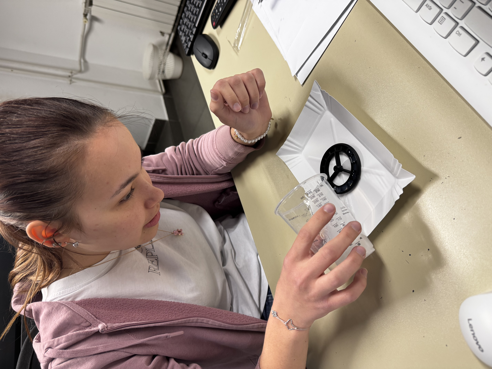  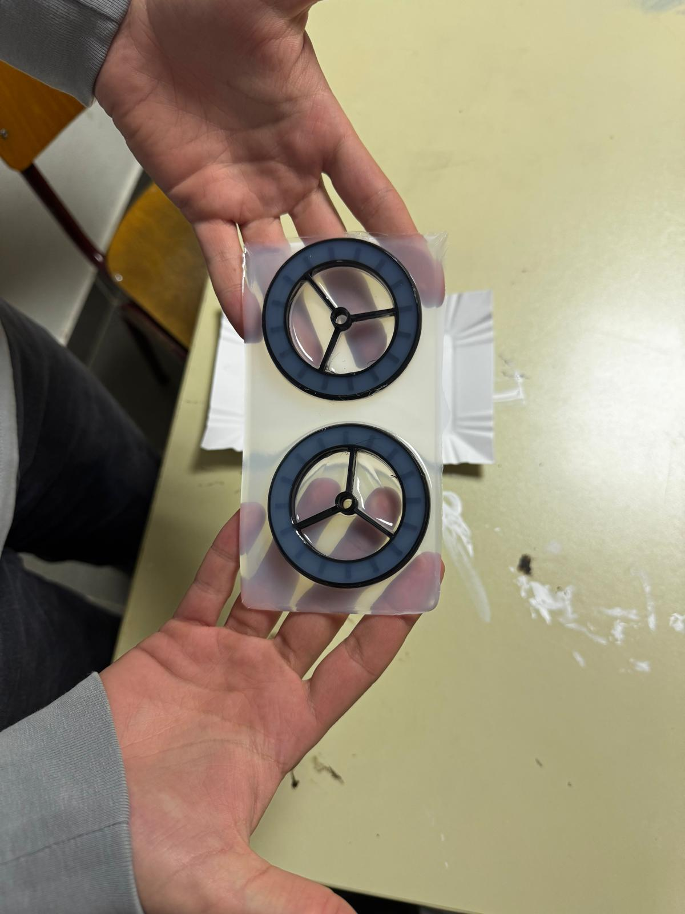 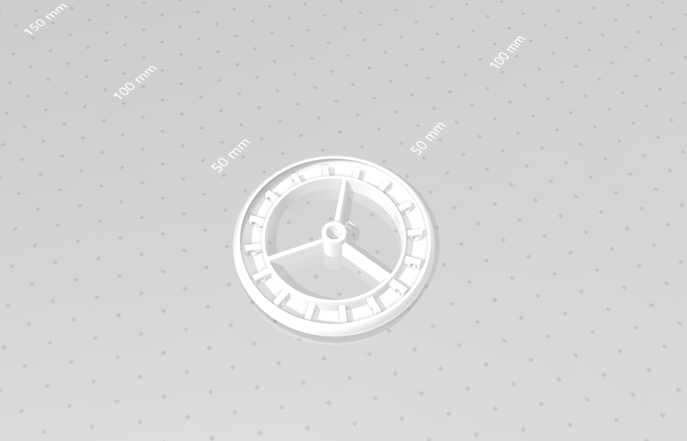

-**chassis**:


<p align="right">
  <a href="#table-of-contents">⬆ Back to Table of Contents</a>
</p>

### 11.2 Assembly

<p align="right">
  <a href="#table-of-contents">⬆ Back to Table of Contents</a>
</p>


## 12. Repository Structure
This repository is organized into separate folders for documentation, hardware, software, media and testing. It makes it easier to locate files needed to understand and reproduce the robot.

```text
WRO/
├── README.md
│
├── backup photos/
│   └── lego - mechaminds
│
├── docs/
│   ├── archive/
│   ├── bill-of-materials/
│   ├── images/
│   ├── build-guide.md
│   ├── engineering-decisions.md
│   ├── mechanical-design.md
│   ├── power-and-sensor.md
│   ├── software-arhitecture.md
│   └── testing.md
│
├── hardware/
│
├── media/
│   ├── connection-solution/
│   ├── development/
│   │   ├── version_1/
│   │   ├── version_2/
│   │   │   ├── build/
│   │   │   └── final/
│   │   ├── version_3/
│   │   ├── version_4/
│   │   └── version_4.1/
│   │       ├── before-repair/
│   │       ├── final/
│   │       ├── repair-process/
│   │       └── testing/
│   │
│   ├── final-robot/
│   ├── team/
│   ├── team2
│   ├── team3
│   └── team4
│
├── obstacle challenge/
├── open challenge/
├── Other/
├── software/
└── tests/
```

**OVO JE PODLOZNO MiJENJANU NECE OVAK NIS BIT SAM DA VIDIMO KAK TREBA IZGLEDAT**

<p align="right">
  <a href="#table-of-contents">⬆ Back to Table of Contents</a>
</p>

## 13. Engineering Journal

<p align="right">
  <a href="#table-of-contents">⬆ Back to Table of Contents</a>
</p>
